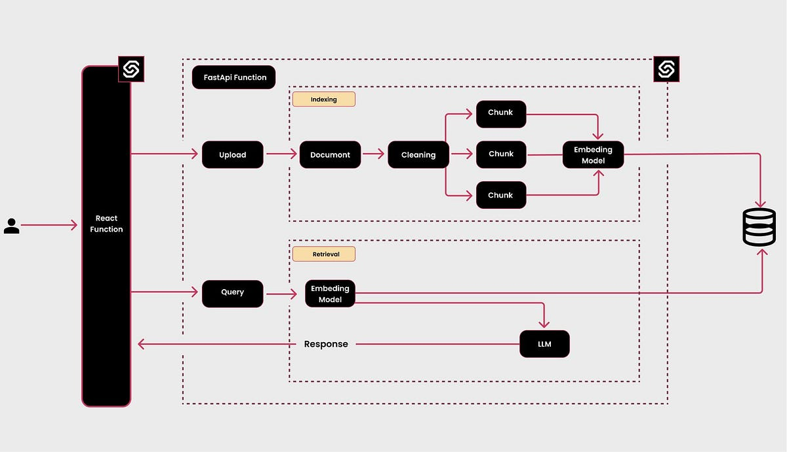

# Deploy Hybrid RAG with Genezio

## How Genezio Makes Deployment Easy, Fast, and Ready for the Real World

### Overview

This repository demonstrates how to deploy a Retrieval-Augmented Generation (RAG) system using Genezio, a cutting-edge Function-as-a-Service (FaaS) platform. The project focuses on providing a fast, scalable, and easy-to-use deployment framework tailored to the needs of machine learning (ML) teams.

By leveraging Genezio, ML teams can simplify infrastructure management, accelerate deployment workflows, and focus on innovation rather than operational complexities. This repository includes code samples, configuration files, and a step-by-step guide to help you set up a hybrid RAG system with Genezio.

---

## Table of Contents

- [What is Genezio?](#what-is-genezio)
- [Why Use Genezio for ML Projects?](#why-use-genezio-for-ml-projects)
- [Repository Features](#repository-features)
- [Prerequisites](#prerequisites)
- [Setup Instructions](#setup-instructions)
  - [Local Testing](#local-testing)
  - [Cloud Deployment](#cloud-deployment)
- [Advanced RAG Architecture](#advanced-rag-architecture)
- [Step-by-Step Deployment Guide](#step-by-step-deployment-guide)
- [Benefits of Using Genezio](#benefits-of-using-genezio)
- [Contributing](#contributing)
- [License](#license)

---

## What is Genezio?

Genezio is a Function-as-a-Service (FaaS) platform designed to simplify and accelerate application deployments. By abstracting away infrastructure management, it enables developers to:

- Deploy serverless functions with minimal setup.
- Scale applications seamlessly without DevOps expertise.
- Test locally and deploy to the cloud with ease.

Learn more about Genezio on [genezio.com](https://genezio.com).

---

## Why Use Genezio for ML Projects?

Machine learning teams often struggle with infrastructure challenges, including lack of DevOps expertise, complex configurations, and inefficient workflows. Genezio addresses these challenges by providing:

- **Ease of Use:** Deploy applications with straightforward YAML configurations.
- **Scalability:** Automatically handle scaling based on workload.
- **Flexibility:** Support for integrating external databases and frameworks.
- **Speed:** Reduce time-to-market for proofs-of-concept and production systems.

---

## Repository Features

This repository includes:

- A 3-tier RAG architecture setup (Web Client, Service Layer, and Vector Database).

    
- Preconfigured Genezio YAML files for deployment.
- Hybrid search mechanisms combining dense, sparse, and late interaction embeddings.
- Synthesizer logic to generate query-specific responses using an LLM.
- Comprehensive examples and step-by-step instructions.

---

## Prerequisites

Before using this repository, ensure you have:

- Node.js and npm installed.
- Python 3.11.9 installed.
- A Genezio account ([sign up here](https://genezio.com)).
- Access to a vector database such as Qdrant.

---

## Setup Instructions

### Local Testing

1. Clone this repository:
   ```bash
   git clone https://github.com/mlrefinery/deploy-hybrid-rag-genezio.git
   cd deploy-hybrid-rag-genezio
